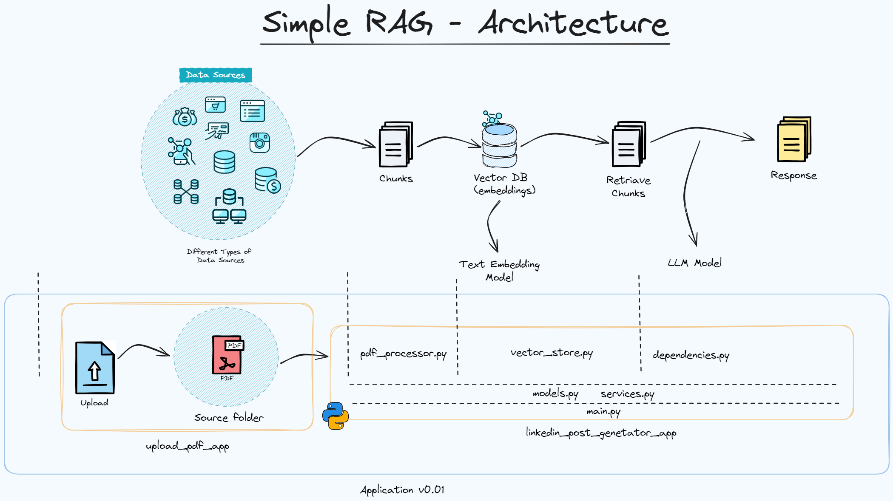

# Description

The linkedin_post_generator app is an asynchronous API designed to generate LinkedIn posts based on provided PDF documents. Here is a high-level overview of its components and functionality:

## RAG-Architecture



## Main Components
1. FastAPI Application (main.py):
    - The app is built using FastAPI, a modern, fast (high-performance) web framework for building APIs with Python.
    - It includes a single endpoint /generate-posts/ that accepts a POST request to generate LinkedIn posts.
    - The endpoint uses dependency injection to get embeddings, a language model (LLM), and an asynchronous session.

1. Post Generator Service (services.py):
    - This service handles the core logic for generating LinkedIn posts.
    - It includes methods to check for file changes, update the vector store, and generate posts.
    - The service uses LangChain for document processing and FAISS for vector storage.

1. Vector Store (vector_store.py):
    - Contains functions to calculate file hashes, load existing hashes, and save updated hashes.
    - These functions help in determining if a PDF file has changed and needs to be reprocessed.

1. PDF Processor (pdf_processor.py):
    - Provides asynchronous functions to load and split PDF documents.
    - Uses LangChain's PyPDFLoader and RecursiveCharacterTextSplitter for document processing.

1. Models (models.py):
    - Defines Pydantic models for request and response data structures.
    - Includes models for LinkedIn post requests and responses.

1. Dependencies (dependencies.py):
    - Provides dependency injection for embeddings and language models.
    - Uses environment variables to configure API keys for external services like Google Generative AI.

# Usage

## Running with Docker

1. Create a `.env` file in the root folder with your API keys:
    ```bash
    OPENAI_API_KEY=<your-api-key>
    GOOGLE_API_KEY=<your-api-key>
    ```

1. Build and run the Docker container:
    ```bash
    docker-compose up --build
    ```

1. Access the API documentation:
    ```bash
    http://localhost:8000/docs
    ```

## Running Locally

1. Create a  file in the root folder with your API keys:
    ```bash
    OPENAI_API_KEY=<your-api-key>
    GOOGLE_API_KEY=<your-api-key>
    ```

1. Install dependencies:
    ```bash
    pip install -r requirements.txt
    ```

1. Run the application:
    ```bash
    python run.py
    ```

1. Access the API documentation:
    ```bash
    http://localhost:8000/docs
    ```

# Documentation

Swagger UI: http://localhost:8000/docs

ReDoc: http://localhost:8000/redoc

# Folders Structure
```
linkedin_post_generator/
├── app/
│   ├── __init__.py
│   ├── dependencies.py
│   ├── main.py
│   ├── models.py
│   ├── pdf_processor.py
│   ├── services.py
│   └── vector_store.py
├── sources/
├── vector_db/
├── .dockerignore
├── .env
├── .gitignore
├── docker-compose.yml
├── dockerfile
├── requirements.txt
└── run.py
```

# Author

This script was written by [Adilson Silva](https://www.linkedin.com/in/adilson-silva-junior/).

# License

This script is released under the [MIT License](https://opensource.org/licenses/MIT).
