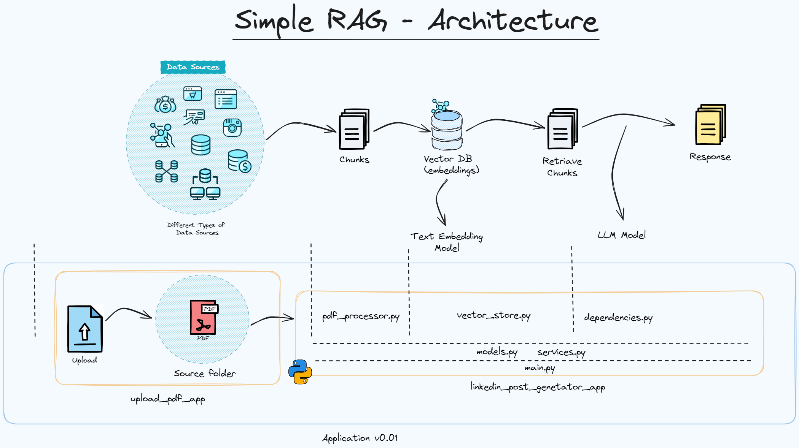

# README.md

# LinkedIn Post Generator Backend

FastAPI backend service for generating LinkedIn posts from PDF documents using AI.

## 🚀 Features

- PDF document processing and text extraction
- AI-powered post generation using OpenAI
- Vector store for efficient document retrieval
- Asynchronous request handling
- Comprehensive logging system

## 🛠️ Technical Stack

- Python 3.12+
- FastAPI
- OpenAI API
- LangChain
- PostgreSQL
- Docker

## 🏗️ Project Structure

```
backend/
├── app/
│   ├── api/           # API endpoints
│   ├── core/          # Core configurations
│   ├── models/        # Data models
│   ├── services/      # Business logic
│   └── utils/         # Utility functions
├── tests/             # Unit tests
└── requirements.txt   # Dependencies
```

## RAG-Architecture




## 📥 Installation

1. Clone the repository:

   ```
   git clone <repository-url>
   cd linkedin-post-generator/backend
   ```

2. Create virtual environment:
```bash
python -m venv .venv
source .venv/bin/activate  # On Windows: .venv\Scripts\activate
pip install -r requirements.txt
```

3. Configure environment variables:
```bash
cp .env.example .env
# Edit .env with your API keys
```

## 🚀 Running the Application

### Development

```bash
uvicorn app.main:app --reload --port 8000
```

### Production

```bash
docker-compose up --build
```

## 🔄 API Endpoints

| Endpoint | Method | Description |
|----------|--------|-------------|
| `/api/posts/generate` | POST | Generate LinkedIn posts |
| `/api/vector-store/update` | POST | Update vector store |

## Logging

The application logs information and errors to `app.log` and the console. Adjust logging settings in `app/core/logging_config.py` as needed.

## Contributing

Contributions are welcome! Please open an issue or submit a pull request for any enhancements or bug fixes.

## 📝 License

MIT License